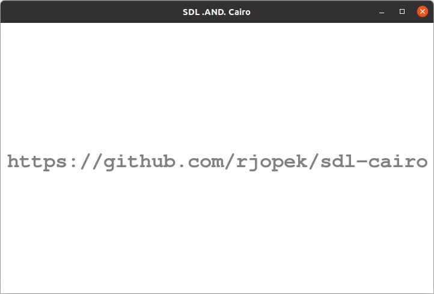

# SDL .AND. Cairo

A tutorial on how to use [SDL](https://www.libsdl.org/) and [Cairo](https://www.cairographics.org/).

This page contains examples on basic concepts of SDL and Cairo. We encourage you to try these examples on your own before looking at the solution. Obviously, this project includes just the basics about programming in C using SDL and Cairo. Also, for sure many things can be improved in it.

### Getting Started

For more info see [getting started](examples/README.md).

### Example

[License](LICENSE)
